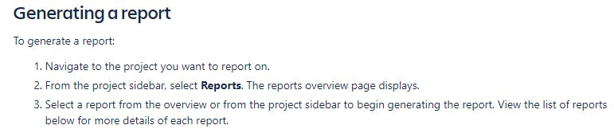
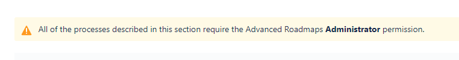
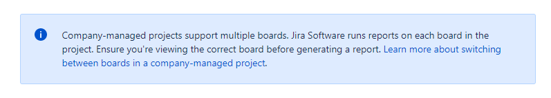
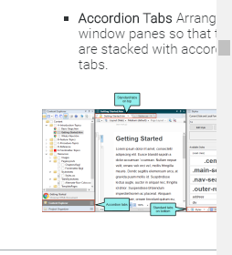

# Wady i zalety dokumentacji Confluence/JIRA/Flare

  - [Confluence](#confluence)
  - [JIRA](#jira)
  - [Flare](#flare)
## Confluence  
 
* **ZALETY**  

  * Podział na najważniejsze tematy na stronie głównej.  Użytkownik może wybrać interesujący go temat i przejść stąd do bardziej szczegółowej strony.  
  * Wprowadzony jest interesujący koncept *‘teams in space’*
  * Dzięki mapie linków po prawej użytkownik może sprawdzić gdzie się znajduje i które punkty zostały już przerobione  
  * ‘Zawartość powiązana’ z prowej strony może pomóc użytkownikowi w znalezieniu powiązanych tematów i zapytań  
  * Noty wydawnicze są łatwo dostępne
   
* **WADY**
  * Niektóre screenshoty są niskej jakości (Image 1) 
  * W sekcji o nazwie “W tej sekcji” bardzo często powtarza się to co samo co widać już w lewej części strony 

   Image 1
## JIRA  
* **ZALETY**

  * Dokumentacja Jira obejmuje szeroki zakres spraw/tematów  
  * W prawej części strony dostępne są linki kierujące do konkretnych zapytań  
  * Dokumentacja skłąda się z przejrzystych informacji, na przykład rodzina produktów Jira jest opisana na początku i podzielona w zależności od typu projektu.   Wymienione są kluczowe funkcje. 
  * Screenshoty/obrazki podpowiadające dalsze kroki (Image 2) 
  * Każda sekcja jest opisana 
  * Podano ostrzeżenia (Image 3) oraz dodatkowe niezbędne informacje (Image 4) 
  * Data modyfikacji na dole strony pomaga w sprawdzaniu czy zawartość jest zaktualizowana  

   Image 2
   Image 3
   Image 4

* **WADY**    

  * Sekcja społeczności - użytkownik może tam znaleźć pytania i dyskusje dotyczące oprogramowania Jira, co wydatnie pomaga użytkownikom mającym problemy z oprogramowaniem. Jednakże, większość pytań pozostaje bez odpowiedzi. Brak możliwości śledzenia tej sekcji może zniechęcać do zadawania pytań.
## Flare  
* **ZALETY**

  * Podział na najważniejsze tematy następuje na głównej stronie. Użytkownik może wybrać interesujący go temat i przejść do bardziej szczegółowej strony.  
  * Wprowadzony jest interesujący koncept *teams in space*  
  * Dzięki mapie linków po prawej użytkownik może sprawdzić gdzie się znajduje i które punkty zostały już przerobione   
  * *‘Zawartość powiązana’* z prowej strony może pomóc użytkownikowi w znalezieniu powiązanych tematów i zapytań  
  * Noty wydawnicze są łatwo dostępne 
* **WADY**

  * W niektórych screenshotach z uwagi na rozmiar nie da się odczytać tekstu (Image 5)  
  * W sekcji o nazwie *'W tej sekcji'* bardzo często powtarza się to co samo co widać już w lewej części strony  

 Image 5